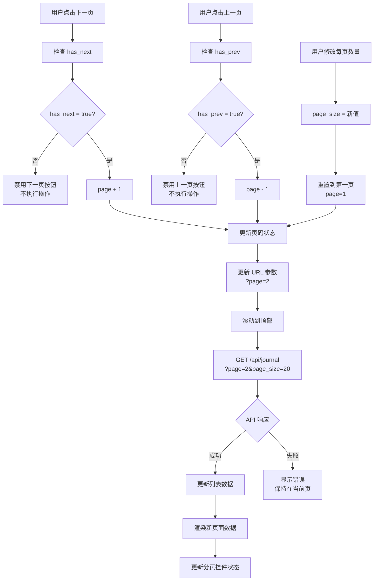
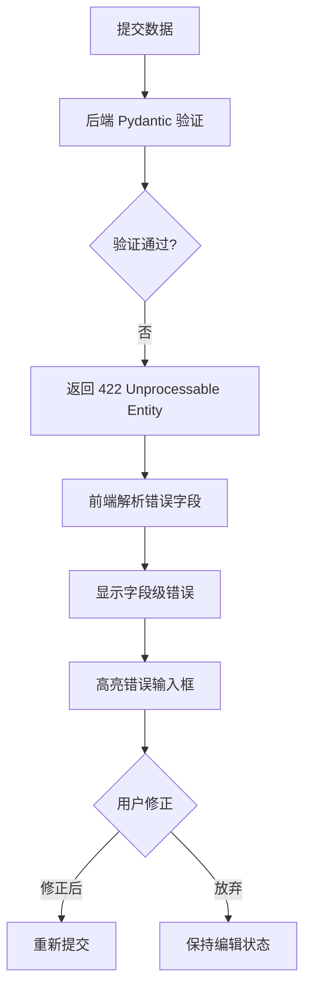
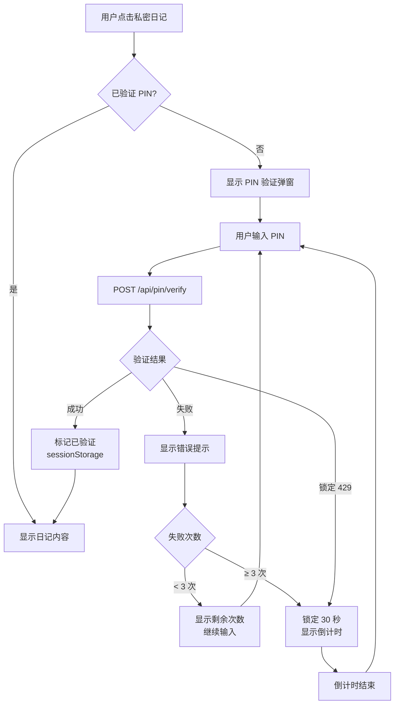

# 日记管理模块 - 业务逻辑流程图

> **API Base URL**: `http://127.0.0.1:8000`
> **API Prefix**: `/api/journal`
> **文档版本**: 1.0
> **创建日期**: 2026-02-25

---

## 目录

1. [数据模型](#数据模型)
2. [API 端点概览](#api-端点概览)
3. [核心业务流程](#核心业务流程)
   - [3.1 初始加载流程](#31-初始加载流程)
   - [3.2 创建日记流程](#32-创建日记流程)
   - [3.3 编辑日记流程](#33-编辑日记流程)
   - [3.4 删除日记流程](#34-删除日记流程)
   - [3.5 搜索与筛选流程](#35-搜索与筛选流程)
   - [3.6 分页流程](#36-分页流程)
   - [3.7 私密日记流程](#37-私密日记流程)
4. [错误处理场景](#错误处理场景)
5. [数据状态管理](#数据状态管理)
6. [缓存策略](#缓存策略)
7. [PIN 认证集成](#pin-认证集成)

---

## 数据模型

### DiaryCreate (创建日记请求)
```typescript
{
  title: string;           // 必填, 1-200 字符
  content: string;         // 必填, 1+ 字符
  mood?: MoodType;         // 可选: "great" | "good" | "neutral" | "bad" | "terrible"
  tags?: string;           // 可选: JSON 数组字符串, 如 '["标签1", "标签2"]'
  related_system?: string; // 可选: 关联系统类型
  is_private?: boolean;    // 可选, 默认 false
}
```

### DiaryUpdate (更新日记请求)
```typescript
{
  title?: string;          // 可选, 1-200 字符
  content?: string;        // 可选, 1+ 字符
  mood?: MoodType;
  tags?: string;
  related_system?: string;
  is_private?: boolean;
}
```

### DiaryResponse (日记响应)
```typescript
{
  id: number;
  user_id: number;
  title: string;
  content: string;
  mood: MoodType | null;
  tags: string | null;
  related_system: string | null;
  is_private: boolean;
  created_at: datetime;    // ISO 8601 格式
  updated_at: datetime;    // ISO 8601 格式
}
```

### PaginatedResponse (分页响应)
```typescript
{
  items: DiaryResponse[];
  total: number;
  page: number;
  page_size: number;
  total_pages: number;
  has_next: boolean;
  has_prev: boolean;
}
```

### ApiResponse (统一响应格式)
```typescript
{
  code: number;            // 状态码: 200, 201, 404, 422, 500
  message: string;         // 消息描述
  data?: T;                // 响应数据
  timestamp: number;       // Unix 时间戳 (毫秒)
}
```

---

## API 端点概览

| 方法 | 端点 | 描述 | 权限 |
|------|------|------|------|
| POST | `/api/journal` | 创建日记 | 公开 |
| GET | `/api/journal` | 获取日记列表 | 公开 |
| GET | `/api/journal/{id}` | 获取日记详情 | 公开 |
| PATCH | `/api/journal/{id}` | 更新日记 | 公开 |
| DELETE | `/api/journal/{id}` | 删除日记 | 公开 |

### 查询参数 (GET /api/journal)

| 参数 | 类型 | 默认值 | 限制 | 描述 |
|------|------|--------|------|------|
| `page` | int | 1 | ≥1 | 页码 |
| `page_size` | int | 20 | 1-100 | 每页数量 |
| `mood` | MoodType | - | - | 按情绪筛选 |
| `related_system` | string | - | - | 按关联系统筛选 |
| `sort_by` | string | `created_at` | - | 排序字段 |
| `sort_order` | `asc\|desc` | `desc` | - | 排序方向 |

---

## 核心业务流程

### 3.1 初始加载流程

**触发时机**: 用户打开日记列表页面 (`/journal`)

```mermaid
flowchart TD
    A[用户打开日记列表页] --> B[组件初始化]
    B --> C{检查缓存}
    C -->|有缓存| D[显示缓存数据<br/>isLoading=false]
    C -->|无缓存| E[显示加载骨架屏<br/>isLoading=true]

    D --> F[后台调用 API]
    E --> F

    F --> G[GET /api/journal<br/>page=1&page_size=20]

    G --> H{API 响应}
    H -->|成功 200| I[解析响应数据<br/>更新 React Query 缓存]
    H -->|失败 4xx/5xx| J[显示错误提示]

    I --> K{数据是否为空?}
    K -->|有数据| L[按日期分组日记<br/>显示日记列表]
    K -->|无数据| M[显示空状态<br/>"开始记录第一篇日记"]

    J --> N[显示重试按钮]
    N --> F

    L --> O[渲染完成]
    M --> O
```

**前端实现要点**:
```typescript
// TanStack Query 配置
const {
  data: paginatedData,
  isLoading,
  error,
  refetch,
} = useJournals({
  page: 1,
  page_size: 20,
});

// 骨架屏显示条件
if (isLoading) {
  return <JournalListSkeleton />;
}

// 错误处理
if (error) {
  return (
    <ErrorState
      message="加载日记失败"
      onRetry={refetch}
    />
  );
}
```

**成功响应示例**:
```json
{
  "code": 200,
  "message": "获取日记列表成功",
  "data": {
    "items": [...],
    "total": 45,
    "page": 1,
    "page_size": 20,
    "total_pages": 3,
    "has_next": true,
    "has_prev": false
  },
  "timestamp": 1740451200000
}
```

---

### 3.2 创建日记流程

**触发时机**: 用户在快速记录区或编辑器中点击"保存日记"

```mermaid
flowchart TD
    A[用户填写日记内容] --> B{点击保存}
    B --> C[客户端表单验证]

    C --> D{验证通过?}
    D -->|失败| E[显示字段错误<br/>阻止提交]
    E --> A

    D -->|通过| F[构建 DiaryCreate 对象]
    F --> G[POST /api/journal<br/>Body: title, content, mood, tags...]

    G --> H{API 响应}

    H -->|成功 201| I[显示成功 Toast<br/>"日记创建成功"]
    H -->|验证失败 422| J[显示验证错误<br/>高亮错误字段]
    H -->|网络错误| K[显示网络错误<br/>保留表单数据]
    H -->|服务器错误 500| L[显示服务器错误<br/>提供重试选项]

    I --> M[乐观更新 UI]
    M --> N[将新日记添加到列表顶部]
    N --> O[重置表单]
    O --> P[跳转到列表页或详情页]

    J --> Q[用户修正错误]
    Q --> F

    K --> R{用户选择}
    R -->|重试| F
    R -->|放弃| S[保持编辑状态]

    L --> T{用户选择}
    T -->|重试| F
    T -->|放弃| S
```

**前端实现要点**:
```typescript
// 使用 Mutation 实现创建
const createMutation = useMutation({
  mutationFn: (data: DiaryCreate) => api.post('/api/journal', data),
  onSuccess: (data) => {
    toast.success('日记创建成功');

    // 乐观更新 - 使列表缓存失效
    queryClient.invalidateQueries({ queryKey: ['journals'] });

    // 跳转到详情页
    navigate(`/journal/${data.data.id}`);
  },
  onError: (error: ApiError) => {
    if (error.code === 422) {
      // 显示字段级错误
      error.data.errors.forEach((err) => {
        toast.error(`${err.field}: ${err.message}`);
      });
    } else {
      toast.error('创建失败,请重试');
    }
  },
});
```

**成功响应示例**:
```json
{
  "code": 200,
  "message": "日记创建成功",
  "data": {
    "id": 123,
    "user_id": 1,
    "title": "美好的一天",
    "content": "今天天气真好...",
    "mood": "good",
    "tags": "[\"生活\", \"心情\"]",
    "related_system": null,
    "is_private": false,
    "created_at": "2026-02-25T12:34:56",
    "updated_at": "2026-02-25T12:34:56"
  },
  "timestamp": 1740451200000
}
```

**验证错误响应示例** (422):
```json
{
  "code": 422,
  "message": "参数验证失败",
  "data": {
    "errors": [
      {
        "field": "mood",
        "message": "心情值无效",
        "value": "invalid_mood"
      }
    ]
  },
  "timestamp": 1740451200000
}
```

---

### 3.3 编辑日记流程

**触发时机**: 用户点击日记的"编辑"按钮或从详情页进入编辑

```mermaid
flowchart TD
    A[用户点击编辑按钮] --> B[跳转到编辑页面<br/>/journal/{id}/edit]

    B --> C[组件初始化]
    C --> D{检查缓存}

    D -->|有缓存| E[使用缓存数据填充表单<br/>isLoading=false]
    D -->|无缓存| F[显示加载骨架屏<br/>isLoading=true]

    E --> G[后台获取最新数据]
    F --> G

    G --> H[GET /api/journal/{id}]

    H --> I{API 响应}
    I -->|成功 200| J[填充表单字段<br/>title, content, mood, tags...]
    I -->|404| K[显示"日记不存在"<br/>返回列表页]
    I -->|其他错误| L[显示错误信息]

    J --> M[用户修改内容]
    M --> N{点击保存}

    N --> O[客户端验证]
    O --> P{验证通过?}
    P -->|否| Q[显示错误提示]
    Q --> M

    P -->|是| R[构建 DiaryUpdate 对象<br/>仅包含修改的字段]

    R --> S[PATCH /api/journal/{id}]

    S --> T{API 响应}
    T -->|成功 200| U[显示成功 Toast<br/>"日记更新成功"]
    T -->|404| V[显示"日记已被删除"<br/>返回列表页]
    T -->|422| W[显示验证错误]

    U --> X[乐观更新缓存]
    X --> Y[更新列表和详情缓存]
    Y --> Z[返回详情页或列表页]

    V --> AA[清理缓存]
    AA --> AB[跳转列表页]

    W --> AC[用户修正]
    AC --> R
```

**前端实现要点**:
```typescript
// 获取日记详情
const { data: journal, isLoading, error } = useJournal(id);

// 表单状态
const [title, setTitle] = useState(journal?.title || '');
const [content, setContent] = useState(journal?.content || '');
const [mood, setMood] = useState(journal?.mood || 'good');

// 更新 Mutation
const updateMutation = useMutation({
  mutationFn: (data: DiaryUpdate) =>
    api.patch(`/api/journal/${id}`, data),
  onSuccess: () => {
    toast.success('日记更新成功');
    queryClient.invalidateQueries({ queryKey: ['journals'] });
    queryClient.invalidateQueries({ queryKey: ['journal', id] });
    navigate(`/journal/${id}`);
  },
  onError: (error: ApiError) => {
    if (error.code === 404) {
      toast.error('日记已被删除');
      queryClient.removeQueries({ queryKey: ['journal', id] });
      navigate('/journal');
    } else if (error.code === 422) {
      toast.error('数据验证失败');
    } else {
      toast.error('更新失败,请重试');
    }
  },
});
```

**重要**: PATCH 请求仅发送修改的字段
```typescript
// 仅发送修改的字段
const updateData: DiaryUpdate = {};
if (title !== journal.title) updateData.title = title;
if (content !== journal.content) updateData.content = content;
if (mood !== journal.mood) updateData.mood = mood;
if (tags !== journal.tags) updateData.tags = JSON.stringify(tags);

updateMutation.mutate(updateData);
```

---

### 3.4 删除日记流程

**触发时机**: 用户在详情页点击"删除"按钮

```mermaid
flowchart TD
    A[用户点击删除按钮] --> B[显示确认对话框<br/>"确定要删除这篇日记吗?"]

    B --> C{用户确认}
    C -->|取消| D[关闭对话框<br/>保持详情页]

    C -->|确认| E[乐观更新 UI]
    E --> F[立即从列表中移除日记<br/>显示删除中状态]

    F --> G[DELETE /api/journal/{id}]

    G --> H{API 响应}

    H -->|成功 200| I[显示成功 Toast<br/>"日记删除成功"]
    I --> J[清理缓存]
    J --> K[从列表缓存移除]
    K --> L[删除详情缓存]
    L --> M[跳转回列表页]

    H -->|404| N[日记已不存在]
    N --> O[清理缓存]
    O --> P[更新 UI<br/>已不在列表中]
    P --> M

    H -->|网络/服务器错误| Q[显示错误 Toast<br/>"删除失败,请重试"]
    Q --> R[回滚乐观更新]
    R --> S[恢复日记到列表中]
    S --> T{用户选择}
    T -->|重试| G
    T -->|放弃| U[保持详情页]
```

**前端实现要点**:
```typescript
// 删除 Mutation with 乐观更新
const deleteMutation = useMutation({
  mutationFn: (id: number) => api.delete(`/api/journal/${id}`),
  onMutate: async (id) => {
    // 取消相关的正在进行的查询
    await queryClient.cancelQueries({ queryKey: ['journals'] });

    // 保存当前快照用于回滚
    const previousJournals = queryClient.getQueryData(['journals']);

    // 乐观更新: 从缓存中移除
    queryClient.setQueryData(['journals'], (old: PaginatedResponse) => ({
      ...old,
      items: old.items.filter((j) => j.id !== id),
      total: old.total - 1,
    }));

    // 显示正在删除状态
    toast.loading('正在删除...');

    return { previousJournals };
  },
  onSuccess: () => {
    toast.dismiss();
    toast.success('日记删除成功');
    // 清理详情缓存
    queryClient.removeQueries({ queryKey: ['journal', id] });
    // 返回列表
    navigate('/journal');
  },
  onError: (error, id, context) => {
    toast.dismiss();
    // 回滚乐观更新
    if (context?.previousJournals) {
      queryClient.setQueryData(['journals'], context.previousJournals);
    }

    if (error.code === 404) {
      toast.success('日记已删除');
      queryClient.removeQueries({ queryKey: ['journal', id] });
      navigate('/journal');
    } else {
      toast.error('删除失败,请重试');
    }
  },
});
```

**成功响应示例**:
```json
{
  "code": 200,
  "message": "日记删除成功",
  "data": {
    "deleted_id": 123
  },
  "timestamp": 1740451200000
}
```

---

### 3.5 搜索与筛选流程

**触发时机**: 用户在搜索框输入、选择情绪筛选、选择系统筛选

```mermaid
flowchart TD
    A[用户输入搜索关键词] --> B[防抖 300ms]

    B --> C[用户选择情绪筛选]
    C --> D[用户选择系统筛选]

    D --> E{是否有激活的筛选条件?}
    E -->|是| F[构建查询参数]
    E -->|否| G[使用默认参数]

    F --> H[重置到第一页<br/>page=1]
    G --> H

    H --> I[GET /api/journal<br/>?page=1&mood=good&related_system=FUEL]

    I --> J[更新 URL 查询参数<br/>/journal?page=1&mood=good]

    J --> K{API 响应}
    K -->|成功| L[更新列表数据]
    K -->|失败| M[显示错误提示]

    L --> N[按日期分组显示]
    N --> O[显示筛选结果数量<br/>"找到 X 篇日记"]

    O --> P[显示清除筛选按钮]
    P --> Q{用户点击清除}
    Q -->|是| R[重置所有筛选条件]
    R --> S[重新请求列表]
    S --> T[恢复显示全部日记]
```

**前端实现要点**:
```typescript
// 筛选状态
const [filters, setFilters] = useState({
  search: '',
  mood: undefined as MoodType | undefined,
  relatedSystem: undefined as string | undefined,
});

// 使用 useDebouncedInput 防抖
const debouncedSearch = useDebouncedInput(filters.search, 300);

// 查询钩子
const { data, isLoading } = useJournals({
  page: 1,
  mood: filters.mood,
  related_system: filters.relatedSystem,
  // 注意: 后端不支持关键词搜索,需在前端过滤
});

// 前端搜索过滤
const filteredItems = useMemo(() => {
  if (!debouncedSearch) return data?.items || [];
  return data?.items.filter((journal) =>
    journal.title.toLowerCase().includes(debouncedSearch.toLowerCase()) ||
    journal.content.toLowerCase().includes(debouncedSearch.toLowerCase())
  ) || [];
}, [data?.items, debouncedSearch]);

// 同步到 URL
useEffect(() => {
  const params = new URLSearchParams();
  if (filters.mood) params.set('mood', filters.mood);
  if (filters.relatedSystem) params.set('related_system', filters.relatedSystem);
  if (debouncedSearch) params.set('search', debouncedSearch);

  const url = params.toString() ? `?${params}` : '';
  navigate(`/journal${url}`, { replace: true });
}, [filters, debouncedSearch]);
```

**重要限制**:
- 后端 API **不支持**关键词搜索参数
- 需要在前端对 `title` 和 `content` 进行过滤
- 分页基于后端数据,前端搜索可能导致分页不准确

---

### 3.6 分页流程

**触发时机**: 用户点击"下一页"/"上一页"或修改每页显示数量



**前端实现要点**:
```typescript
// 分页状态
const [page, setPage] = useState(1);
const [pageSize, setPageSize] = useState(20);

// 查询
const { data, isLoading } = useJournals({
  page,
  page_size: pageSize,
  mood: filters.mood,
});

// 分页控件
<Pagination
  currentPage={page}
  totalPages={data?.total_pages || 1}
  hasNext={data?.has_next || false}
  hasPrev={data?.has_prev || false}
  onPageChange={(newPage) => {
    setPage(newPage);
    window.scrollTo({ top: 0, behavior: 'smooth' });
  }}
  pageSize={pageSize}
  onPageSizeChange={(newSize) => {
    setPageSize(newSize);
    setPage(1); // 重置到第一页
  }}
/>

// URL 同步
useEffect(() => {
  const params = new URLSearchParams();
  params.set('page', String(page));
  params.set('page_size', String(pageSize));

  navigate(`/journal?${params}`, { replace: true });
}, [page, pageSize]);
```

---

## 错误处理场景

### 4.1 网络超时 (Timeout)

**触发**: 请求超过 30 秒未响应

```mermaid
flowchart TD
    A[发起 API 请求] --> B{30 秒内响应?}
    B -->|否| C[触发 TimeoutMiddleware]
    C --> D[返回 408 Request Timeout]

    D --> E[前端捕获错误]
    E --> F[显示超时提示<br/>"请求超时,请检查网络连接"]

    F --> G{用户选择}
    G -->|重试| H[重新发起请求]
    G -->|取消| I[回滚到之前状态]
```

**错误响应示例**:
```json
{
  "code": 408,
  "message": "请求超时",
  "data": {
    "timeout": 30.0
  },
  "timestamp": 1740451200000
}
```

---

### 4.2 请求过于频繁 (Rate Limiting)

**触发**: 短时间内请求次数超限

```mermaid
flowchart TD
    A[发起 API 请求] --> B{检查请求频率}
    B -->|超限| C[RateLimitMiddleware 拦截]
    C --> D[返回 429 Too Many Requests]

    D --> E[前端显示提示<br/>"请求过于频繁,请稍后再试"]
    E --> F[显示剩余等待时间<br/>X-RateLimit-Reset]

    F --> G[禁用操作按钮]
    G --> H[倒计时结束后恢复]
```

**响应头信息**:
```
X-RateLimit-Limit: 60
X-RateLimit-Remaining: 0
X-RateLimit-Reset: 1740451260000
```

**错误响应示例**:
```json
{
  "code": 429,
  "message": "请求过于频繁,请稍后再试",
  "data": {
    "limit": 60,
    "remaining": 0,
    "reset": "2026-02-25T12:34:20.000Z"
  },
  "timestamp": 1740451200000
}
```

---

### 4.3 验证错误 (422)

**触发**: 提交的数据不符合验证规则



**验证规则**:
| 字段 | 规则 |
|------|------|
| `title` | 1-200 字符,必填 |
| `content` | ≥1 字符,必填 |
| `mood` | 必须为 `great\|good\|neutral\|bad\|terrible` |
| `is_private` | 布尔值 |

---

### 4.4 资源不存在 (404)

**触发**: 请求不存在的日记 ID

```mermaid
flowchart TD
    A[请求日记详情] --> B[后端查询数据库]
    B --> C{日记存在?}
    C -->|否| D[返回 404 Not Found]

    D --> E[前端显示错误页<br/>"日记不存在"]
    E --> F[提供返回列表按钮]
    F --> G[清理无效缓存]
    G --> H[跳转到列表页]
```

---

### 4.5 并发修改冲突 (不适用)

**说明**: 应用已实现单实例锁定 (`makeAppWithSingleInstanceLock`)，用户无法同时打开多个窗口，因此**不存在并发修改冲突**的问题。

---

### 4.6 私密日记 - PIN 未设置错误

**触发**: 用户勾选私密选项但未设置 PIN

```mermaid
flowchart TD
    A[用户勾选私密选项] --> B[检查 PIN 状态]
    B --> C{已设置 PIN?}
    C -->|否| D[显示提示<br/>"需要先设置 PIN 码"]

    D --> E[提供跳转按钮<br/>"前往设置 PIN"]
    E --> F{用户选择}
    F -->|确认| G[跳转到 PIN 设置页面]
    F -->|取消| H[取消私密选项<br/>保持编辑状态]

    G --> I[用户设置 PIN]
    I --> J{设置成功?}
    J -->|是| K[返回日记编辑页<br/>自动勾选私密选项]
    J -->|否| L[提示设置失败<br/>保持在 PIN 设置页]
```

---

## 数据状态管理

### 5.1 TanStack Query 缓存策略

```typescript
// query-client.ts 配置
const queryClient = new QueryClient({
  defaultOptions: {
    queries: {
      staleTime: 5 * 60 * 1000,    // 5 分钟内认为数据新鲜
      gcTime: 10 * 60 * 1000,      // 10 分钟后清理未使用缓存
      retry: 1,                     // 失败重试 1 次
      refetchOnWindowFocus: false,  // 禁用窗口聚焦自动刷新
    },
  },
});
```

### 5.2 缓存键结构

```typescript
// 列表缓存
['journals', { page, page_size, mood, related_system }]

// 详情缓存
['journal', id]

// 无限滚动 (未来可选)
['journals-infinite', { mood, related_system }]
```

### 5.3 缓存失效时机

| 操作 | 失效缓存 |
|------|----------|
| 创建日记 | `['journals']` |
| 更新日记 | `['journal', id]`, `['journals']` |
| 删除日记 | `['journal', id]`, `['journals']` |
| 筛选/分页 | 自动重新请求 |

---

## 缓存策略

### 6.1 乐观更新 (Optimistic Updates)

**适用场景**: 创建、更新、删除操作

```typescript
onMutate: async (newData) => {
  // 1. 取消正在进行的查询
  await queryClient.cancelQueries({ queryKey: ['journals'] });

  // 2. 保存当前快照
  const previousData = queryClient.getQueryData(['journals']);

  // 3. 乐观更新
  queryClient.setQueryData(['journals'], (old) => ({
    ...old,
    items: [newData, ...old.items],
    total: old.total + 1,
  }));

  // 4. 返回上下文用于回滚
  return { previousData };
}
```

### 6.2 重新验证 (Revalidation)

```typescript
onSuccess: () => {
  // 使相关缓存失效,触发重新请求
  queryClient.invalidateQueries({
    queryKey: ['journals']
  });
}
```

### 6.3 错误回滚 (Rollback)

```typescript
onError: (error, variables, context) => {
  // 回滚到保存的快照
  if (context?.previousData) {
    queryClient.setQueryData(['journals'], context.previousData);
  }
}
```

---

## 前后端数据映射

### 前端模型 vs 后端模型

| 前端字段 | 后端字段 | 类型转换 |
|----------|----------|----------|
| `id` | `id` | `string` → `number` |
| `timestamp` | `created_at` | `number` → `datetime` |
| `mood` | `mood` | 保持一致 |
| `tags` | `tags` | `string[]` → `string` (JSON) |
| `linkedDimensions` | `related_system` | `string[]` → `string` (单一) |

### 数据转换函数

```typescript
// 前端 → 后端
function toDiaryCreate(data: FrontendJournal): DiaryCreate {
  return {
    title: data.title || '',
    content: data.content,
    mood: data.mood,
    tags: data.tags.length > 0 ? JSON.stringify(data.tags) : undefined,
    related_system: data.linkedDimensions[0] || undefined,
    is_private: false,
  };
}

// 后端 → 前端
function toFrontendJournal(data: DiaryResponse): FrontendJournal {
  return {
    id: String(data.id),
    timestamp: new Date(data.created_at).getTime(),
    title: data.title,
    content: data.content,
    mood: data.mood || 'neutral',
    tags: data.tags ? JSON.parse(data.tags) : [],
    linkedDimensions: data.related_system ? [data.related_system] : [],
    attachments: [],
  };
}
```

---

### 3.7 私密日记流程

**触发时机**: 用户在创建或编辑日记时勾选"私密日记"选项

```mermaid
flowchart TD
    A[用户勾选私密选项] --> B[前端检查 PIN 状态]
    B --> C{已设置 PIN?}

    C -->|是| D[允许勾选私密]
    D --> E[保存日记时<br/>is_private: true]

    C -->|否| F[显示提示对话框]
    F --> G["需要先设置 PIN 码才能使用私密功能"]
    G --> H{用户选择}

    H -->|前往设置| I[保存当前草稿<br/>localStorage]
    I --> J[跳转 /settings/pin]
    J --> K[PIN 设置页面]

    H -->|取消| L[取消勾选私密<br/>保持编辑状态]

    K --> M[用户输入 6 位 PIN]
    M --> N[点击确认设置]
    N --> O[POST /api/pin/setup<br/>Body: { pin: '123456' }]

    O --> P{API 响应}
    P -->|成功 200| Q[显示成功提示<br/>"PIN 设置成功"]
    Q --> R[自动返回日记编辑页]
    R --> S[自动勾选私密选项]

    P -->|失败 409| T["PIN 已存在"]
    P -->|失败 422| U["PIN 格式错误<br/>必须是 6 位数字"]

    T --> V[提示用户<br/>"PIN 已设置"]
    U --> W[提示用户<br/>"请输入 6 位数字"]

    V --> M
    W --> M

    S --> E
    E --> AA[日记保存成功<br/>标记为私密]
```

**前端实现要点**:

```typescript
// 检查 PIN 状态
const { data: pinStatus } = useQuery({
  queryKey: ['pin-status'],
  queryFn: () => api.get('/api/pin/status'),
});

// 处理私密选项变化
const handlePrivateToggle = (checked: boolean) => {
  if (checked && !pinStatus?.has_pin_set) {
    // 未设置 PIN，显示提示
    showDialog({
      title: '需要设置 PIN 码',
      content: '私密日记功能需要先设置 PIN 码保护',
      confirmText: '前往设置',
      onConfirm: () => {
        // 保存草稿
        localStorage.setItem('journal-draft', JSON.stringify(formData));
        // 跳转到 PIN 设置页
        navigate('/settings/pin');
      },
    });
    return;
  }

  setIsPrivate(checked);
};

// 创建/更新日记时
const saveData = {
  ...formData,
  is_private: isPrivate,
};

api.post('/api/journal', saveData);
```

**私密日记标记**:
- 列表页显示锁图标 🔒
- 详情页需要验证 PIN 才能查看内容
- 搜索结果中隐藏私密日记内容（仅显示标题）

---

## 7. PIN 认证集成

### 7.1 PIN API 端点

| 方法 | 端点 | 描述 | 请求体 |
|------|------|------|--------|
| GET | `/api/pin/status` | 获取 PIN 状态 | - |
| POST | `/api/pin/setup` | 首次设置 PIN | `{ pin: string }` |
| POST | `/api/pin/verify` | 验证 PIN | `{ pin: string }` |
| POST | `/api/pin/change` | 修改 PIN | `{ old_pin, new_pin }` |
| POST | `/api/pin/lock` | 锁定应用 | - |

### 7.2 PIN 状态响应

**GET /api/pin/status 响应**:
```json
{
  "code": 200,
  "message": "状态获取成功",
  "data": {
    "has_pin_set": true
  },
  "timestamp": 1740451200000
}
```

### 7.3 设置 PIN 请求

**POST /api/pin/setup 请求**:
```json
{
  "pin": "123456"
}
```

**验证规则**:
- 必须是 6 位数字
- 只能设置一次（后续使用 `/api/pin/change` 修改）

**成功响应** (200):
```json
{
  "code": 200,
  "message": "PIN 设置成功",
  "data": {
    "redirect_to": "/canvas"
  },
  "timestamp": 1740451200000
}
```

**失败响应** (409 - 已设置):
```json
{
  "code": 409,
  "message": "PIN 已设置",
  "data": {
    "conflict": "PIN_ALREADY_SET",
    "hint": "请使用 /api/pin/change 接口修改 PIN"
  },
  "timestamp": 1740451200000
}
```

### 7.4 验证 PIN 请求

**POST /api/pin/verify 请求**:
```json
{
  "pin": "123456"
}
```

**成功响应** (200):
```json
{
  "code": 200,
  "message": "验证成功",
  "data": {
    "verified": true,
    "user_id": 1
  },
  "timestamp": 1740451200000
}
```

**失败响应** (401 - PIN 错误):
```json
{
  "code": 401,
  "message": "PIN 验证失败",
  "data": {
    "attempts_remaining": 2
  },
  "timestamp": 1740451200000
}
```

**失败响应** (429 - 锁定):
```json
{
  "code": 429,
  "message": "PIN 验证失败次数过多，已锁定 30 秒",
  "data": {
    "remaining_seconds": 30
  },
  "timestamp": 1740451200000
}
```

### 7.5 前端 PIN 设置页面

**页面路径**: `/settings/pin`

**功能**:
1. 输入 6 位 PIN 码
2. 确认 PIN 码
3. 提交设置
4. 成功后返回原页面

**UI 组件**:
```typescript
// PIN 设置页面组件
function PinSetupPage() {
  const [pin, setPin] = useState('');
  const [confirmPin, setConfirmPin] = useState('');
  const navigate = useNavigate();

  const setupMutation = useMutation({
    mutationFn: (pin: string) => api.post('/api/pin/setup', { pin }),
    onSuccess: () => {
      toast.success('PIN 设置成功');
      // 返回原页面或日记编辑页
      const returnUrl = localStorage.getItem('pin-return-url') || '/journal';
      localStorage.removeItem('pin-return-url');
      navigate(returnUrl);
    },
    onError: (error: ApiError) => {
      if (error.code === 409) {
        toast.error('PIN 已设置');
      } else {
        toast.error('PIN 设置失败');
      }
    },
  });

  const handleSubmit = () => {
    if (pin.length !== 6) {
      toast.error('请输入 6 位数字 PIN');
      return;
    }
    if (pin !== confirmPin) {
      toast.error('两次输入的 PIN 不一致');
      return;
    }
    setupMutation.mutate(pin);
  };

  return (
    <div>
      <Input
        type="password"
        maxLength={6}
        value={pin}
        onChange={(e) => setPin(e.target.value.replace(/\D/g, '').slice(0, 6))}
        placeholder="请输入 6 位 PIN 码"
      />
      <Input
        type="password"
        maxLength={6}
        value={confirmPin}
        onChange={(e) => setConfirmPin(e.target.value.replace(/\D/g, '').slice(0, 6))}
        placeholder="确认 PIN 码"
      />
      <Button onClick={handleSubmit}>确认设置</Button>
    </div>
  );
}
```

### 7.6 查看私密日记流程



**前端实现要点**:

```typescript
// 检查会话中是否已验证 PIN
const isPinVerified = sessionStorage.getItem('pin-verified') === 'true';

// 查看私密日记
const handleViewPrivate = (journalId: string) => {
  if (!isPinVerified) {
    // 显示 PIN 验证弹窗
    showPinDialog({
      onVerify: async (pin: string) => {
        const result = await api.post('/api/pin/verify', { pin });
        if (result.verified) {
          sessionStorage.setItem('pin-verified', 'true');
          // 显示日记内容
          navigate(`/journal/${journalId}`);
        }
      },
    });
  } else {
    navigate(`/journal/${journalId}`);
  }
};

// 锁定应用时清除验证状态
const lockApp = () => {
  sessionStorage.removeItem('pin-verified');
  setIsLocked(true);
};
```

---

## 总结

### 关键要点

1. **统一响应格式**: 所有 API 响应都遵循 `{ code, message, data, timestamp }` 格式
2. **错误优先处理**: 必须处理所有可能的错误场景 (网络、验证、服务器)
3. **乐观更新**: 提升用户体验,但必须实现回滚机制
4. **缓存管理**: 合理使用 TanStack Query 缓存策略
5. **防抖节流**: 搜索输入必须防抖,避免频繁请求
6. **URL 同步**: 筛选和分页状态应同步到 URL,支持分享和刷新
7. **单窗口限制**: 应用已实现单实例锁定,不存在并发修改问题
8. **私密日记**: 必须先设置 PIN 才能使用私密功能,查看需验证 PIN

### 待实现功能

- [ ] 无限滚动加载 (替代分页)
- [ ] 批量操作 (批量删除、批量导出)
- [ ] 富文本编辑器图片上传
- [ ] 日记附件管理
- [ ] 编辑历史版本
- [ ] 本地离线编辑队列
- [x] 私密日记功能 (PIN 集成)

---

**文档结束**
